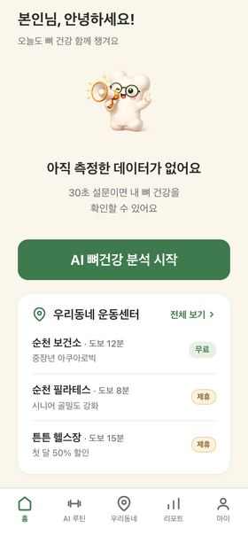
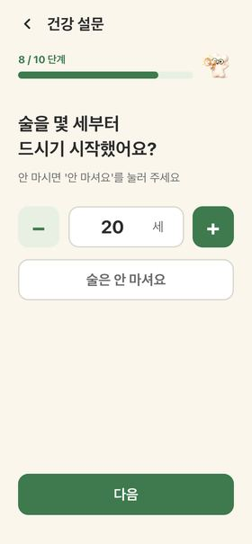
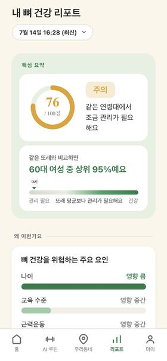
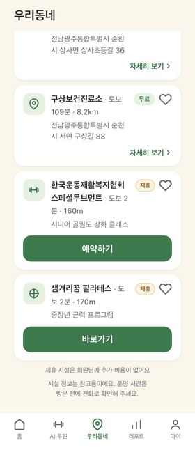
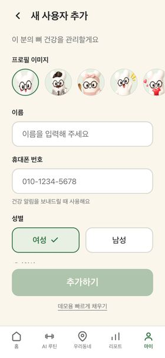
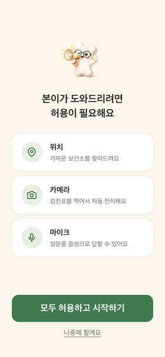

# 🦴 본주르 (BonJour) — AI 뼈 건강 플랫폼

> **30초 설문으로 내 뼈의 미래를 읽다.**
> 40~60대 여성을 위한 AI 골다공증 위험 예측 & 웰에이징 서비스 (MVP)

**👉 지금 바로 체험: https://bonjourver10.vercel.app**
폰에서 열고 "홈 화면에 추가"하면 앱처럼 사용할 수 있어요 — 앱스토어 설치 불필요 (PWA)

---

## 어떤 서비스인가요?

골다공증은 증상 없이 진행되다 골절로 발견되는 경우가 많습니다. 본주르는 **병원에 가기 전, 집에서 30초 만에** 뼈 건강 위험도를 확인하고 → 왜 위험한지 이해하고 → 무엇을 하면 좋아지는지 → 어디서 시작할지(우리 동네)까지 한 번에 이어주는 서비스입니다.

**측정 → 이해 → 행동 → 지역 연결**, 그리고 부모님까지 **가족 단위 관리**.

## 주요 기능

| | 기능 | 설명 |
|---|---|---|
| 📝 | **30초 설문 (10문항)** | 시니어 친화 큰 글씨·큰 버튼. **음성으로도 답변 가능** (마스코트 '본이'가 질문을 읽어줘요) |
| 📷 | **건강검진표 AI 인식** | 검진표를 사진 찍으면 AI(Google Gemini 비전)가 수치를 자동으로 읽어요. 검진 실측값이 자가응답보다 우선 적용 |
| 📊 | **AI 리포트** | Bone Score(100점), 또래 대비 위치, 위험 요인·뼈건강 긍정요인을 쉬운 말로 설명 |
| 🔮 | **시뮬레이터** | "운동을 주 6회로 늘리면?" — 행동을 바꿨을 때 점수 변화를 미리 보여줘요 |
| 💪 | **AI 맞춤 루틴** | 내 위험 요인 기반 운동 처방 + 공식 따라하기 영상 |
| 📍 | **우리동네** | 내 위치 기준 **실제 보건소·운동시설**을 거리순으로 — 카카오맵 연결로 바로 예약·길찾기 |
| 👨‍👩‍👧 | **가족 프로필** | 부모님·배우자 프로필을 아바타와 함께 추가하고 한 폰에서 전환·수정 |

## 화면 미리보기

| 홈 | 설문 (음성 지원) | AI 리포트 |
|---|---|---|
|  |  |  |

| 우리동네 (실데이터) | 가족 프로필 | 첫 실행 권한 안내 |
|---|---|---|
|  |  |  |

## 예측은 어떻게 하나요?

- 국민건강영양조사(KNHANES) 공공데이터로 학습한 **자체 통계 모델**(로지스틱 회귀, 16개 변수)로 계산합니다
- 계산이 **전부 앱 안에서** 이뤄져 **개인 건강정보가 외부 서버로 나가지 않아요** (검진표 이미지만 인식 목적으로 AI 처리)
- 점수만이 아니라 **변수별 기여도**(선형모델의 SHAP 동치)로 "왜"까지 설명합니다
- 현재 모델은 여성 데이터 기준 — 남성용 예측 AI는 개발 중입니다

## 사용된 기술 (한눈에)

| 분류 | 기술 |
|---|---|
| 위치·시설 검색 | 카카오 로컬 API, 카카오맵 |
| 검진표 인식 | Google Gemini 비전 (+ 기기 내 tesseract 안전망) |
| 음성 설문 | 브라우저 내장 음성 인식/합성 (별도 서버 없음) |
| 예측 모델 | 자체 로지스틱 회귀 — scikit-learn 학습 → 계수를 앱에 내장해 동일 계산 재현 |
| 앱 | Next.js 14 · React 18 · TypeScript · Tailwind · Zustand · PWA · Vercel |

---

# 개발자 가이드

## 빠른 시작

```bash
npm install
npm run dev        # http://localhost:3000 (390×844 모바일 프레임)
npm test           # 소스 계약 테스트 (node --test)
npm run build      # 프로덕션 빌드
```

선택 환경변수 (`.env.local.example` 참고 — 없어도 폴백으로 전 기능 동작):

| 키 | 용도 | 없을 때 |
|---|---|---|
| `KAKAO_REST_API_KEY` | 주변 보건소·운동시설 실검색, 좌표→주소 | 순천 예시 데이터 |
| `GEMINI_API_KEY` | 검진표 비전 OCR (1차 엔진) | 기기 내 tesseract |
| `ANTHROPIC_API_KEY` | 검진표 OCR 최상위 엔진 (선택) | Gemini 사용 |

배포: `vercel --prod` (Vercel 프로젝트 연결 필요)

## 폴더 구조

```
app/
  page.tsx          스플래시 → start/(QR 랜딩) → permissions/(권한 안내) → signup/
  survey/           설문 10문항 (터치/음성 모드, 분기 로직)
  checkup/          건강검진 입력 (사진 OCR / 직접 입력)
  analysis/         AI 분석 → report/(리포트) → simulator/(시뮬레이터)
  routine/ local/   맞춤 루틴 · 우리동네
  mypage/ settings/ 마이페이지 · 앱 설정(권한 관리)
  profile-add/      가족 프로필 추가/수정 (아바타 선택)
  api/              health-centers(카카오) · ocr(Gemini/tesseract) · reverse-geocode
components/         공용 UI — PageHeader·Boni(마스코트)·Avatar·Dialog·TabBar 등
lib/
  predict.ts        ⭐ 예측 엔진 (아래 참고)
  modelParams.ts    DA joblib에서 추출한 모델 계수 (수정 금지)
  survey.ts         설문 문항 정의 · prescription.ts 처방 규칙 · store.ts 상태
```

## ⭐ 예측 엔진 — 진짜 모델이 앱 안에서 돕니다

`lib/predict.ts`는 DA팀 최종 로지스틱 모델(`최종모델_설문검진_로지스틱.joblib`)의
**표준화 기준(mean·std) + 계수 + 절편**을 추출해 담은 `modelParams.ts`로
`sigmoid(절편 + Σ 계수·표준화값)`을 계산합니다 — Python `predict_proba()`와 **완전 동일**(검증 완료).
그래서 Python 서버 없이 정적 배포만으로 실제 모델이 동작합니다.

| 화면 | 함수 | 계산 |
|---|---|---|
| 리포트 점수 | `predict()` → `boneScore` | `100 × (1 − 위험확률)` |
| 위험/긍정 요인 | `predict()` → `riskFactors` | 계수 × 표준화값 (선형모델 SHAP 동치) |
| 또래 비교 | `computePercentile()` | 연령대 분포 내 위치 (이진탐색) |
| 시뮬레이터 | `simulate()` / `optimalControllables()` | 통제변수 변경 재계산 (DiCE 안전 구현) |

- 입력 우선순위: 시뮬레이터 조작 > **검진표 실측값** > 설문 자가응답
- 나이는 설문에서 묻지 않고 가입 생년월일에서 파생 (`lib/age`)
- 등급: 위험확률 ≥0.34 높음 / ≥0.20 주의 / 미만 정상 (DA `서비스_처리규칙.json` 기준)

**모델 재학습 시**: 새 joblib에서 `cols, medians, scalerMean, scalerScale, coef, intercept, threshold, peer, conv`를 추출해 `lib/modelParams.ts` 값만 교체하면 됩니다.

---

## 저작권 / 데이터 출처

- **운동 영상**: 보건복지부·한국건강증진개발원(KHEPI) 공식 영상, **공공누리 제4유형** (출처표시 + 상업적이용금지 + 변경금지). 원본 유튜브 임베드만 사용, 편집·재호스팅 금지. 영상 카드 하단에 출처 표기.
- **예측 근거 데이터**: 국민건강영양조사(KNHANES) 공공데이터
- **캐릭터('본이')·로고**: 본주르 팀 자체 제작 — 무단 사용 금지
